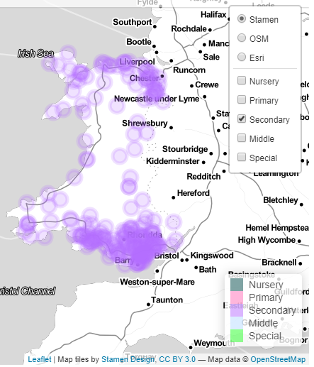

Aside
================================================================================

[Click to view](https://rpubs.com/M_Merciless/wales_sch_funding1819)
 

Contact Info {#contact}
--------------------------------------------------------------------------------

- <i class="fa fa-envelope"></i> leyshonrr@hotmail.co.uk
- <i class="fab fa-github-square"></i> [My Github profile](https://github.com/M-Merciless)
- <i class="fab fa-r-project"></i> [My RPubs profile](https://rpubs.com/M_Merciless)
- <i class="fab fa-twitter-square"></i> [Rich_L1984](https://twitter.com/Rich_L1984)
- <i class="fab fa-linkedin"></i> [richard_leyshon](https://www.linkedin.com/in/richard-leyshon-316121163/)
- <i class="fas fa-link"></i> [View my projects here](https://sway.office.com/MFGdpogCMdZAad1v?ref=Link)
 

Skills {#skills}
--------------------------------------------------------------------------------

- Experienced in data analysis, statistics and programming.

- Seasoned educator with 9 years experience in teaching high school science.

- Skilled in R, Python, DAX, Power Query and SQL. 

Disclaimer {#disclaimer}
--------------------------------------------------------------------------------

This resume was made with the R package [**pagedown**](https://github.com/rstudio/pagedown).

Last updated on `r format(Sys.Date(), format = '%d %B %Y')`.

Main
================================================================================

Richard Leyshon {#title}
--------------------------------------------------------------------------------

Education {data-icon=graduation-cap data-concise=true}
--------------------------------------------------------------------------------

### Acorn Learning Solutions
Level 4 Diploma in Data Analytics

Cardiff, Wales

2018 to 2019

2 year course completed in 13 months

Modules: 

- Principles of Data Management Infrastructure
- Data Analysis Tools
- Data Science
- Statistical Analysis of Data Sets
- Designing and Developing Event-Driven Computer Programs
- Designing and Developing Procedural Computer Programs
- Advanced Data Representations and Manipulation for IT 

### University of Wales, Institute Cardiff
Post Graduate Certificate in Education (Science)

Cardiff, Wales

2006 to 2007

Placements:

- Windsor-Clive Primary School
- Llanedeyrn high school
- Whitchurch High School

Qualified Teacher Status awarded

### Cardiff University
Bsc (Hons) Biology, 2:1 awarded

Cardiff, Wales

2002 to 2005

My degree contained several data-related modules including:

- Two modules of **The Biological Application of Mathematics and Statistics**
- Statistical analysis within [Minitab](https://www.minitab.com/en-us/products/minitab/)
- **Conservation Ecology**
- Use of statistical modelling to conduct population viability analysis 
- Modelling techniques with [Vortex](https://www.cpsg.org/our-approach/science-based-tools/vortex) 
- **Final Year Field Course**
- Collection of field data for wildfowl populations
- Minitab statistical analysis of data generated from this enquiry
- **Laboratory Practical Enquiry**
- Hypothesis testing in a wide range of scientific contexts
- Application of the scientific method in ensuring reproducibility
- Research, reporting and referencing

Professional Experience {data-icon=suitcase}
--------------------------------------------------------------------------------

### Statistician  
 
Data Cymru  

Cardiff, Wales

2020 to Present

- Cleansing and analysis of survey output through to analysis in R markdown
- Hypothesis testing using statistical methods such as t-test, Mann-Whitney test and Monte Carlo power analysis
- Linear and multiple regression, utilisation of modelled residuals in decision-making
- Key stakeholder engagement with external clients in defining the scope of projects and responding to user feedback
- Operationalising Shiny applications interactive html interfaces on remote servers such as shinyapps io, Github & Rpubs
- Production and operationalising of geospatial analysis dashboards
- Collaborative workflow management utilising Microsoft Planner, Teams and Sharepoint 
- Querying open data feeds to update key organisational workflows to achieve reproducibility, minimise human error and automate tasks where possible
- Use of database management functions to achieve data insights through data joins, lookups and transformations 

::: aside

Personal Projects 

The below links are to a selection of applications created in  my own time:

[Welsh School Budgeted & Outturn 1920, Shiny Application](https://richleysh84.shinyapps.io/education_combined_scatter_v3/)

[Welsh Common Place Name Explorer, Shiny Application](https://richleysh84.shinyapps.io/common_placenames/)

[Welsh School Budgeted Education Revenue 18/19, Flexdashboard html](https://rpubs.com/M_Merciless/wales_sch_funding1819)

 
 
 

:::

### Data Analytics Apprentice
 
Wales Audit Office  

Cardiff, Wales  

2018 to 2019

- Established proof of concept: satellite analysis of woodland inventory to assist in financial audit of Natural Resources Wales
- Development of Power BI Dashboards in order to support performance audit and thematic review
- Establishment of relational data models, joining datasets and lookup tables
- Programming Shiny applications for exploratory data analysis
- Developing counter fraud and error risk testing of transactions in R
- Publication of R markdown interactive reports to help inform auditor opinion
- Assisting in the delivery of the WAO's Power BI education programme to internal and external colleagues
- Maintaining a high standard of output within a fast-paced, AGILE work environment
- Effective written and verbal communication to a wide variety of stakeholders within various contexts

### Teacher of Science  
 
St Illtyd's Catholic High School, Fitzalan and Bassaleg High School  

Cardiff, Newport,  Wales

2007 to 2017

- Delivery of biology and physics education to A level
- Experienced in the effective communication of technical subject matter
- Differentiation of learning material to a wide range in student ability
- High standards of reporting, assessment and proof-reading

